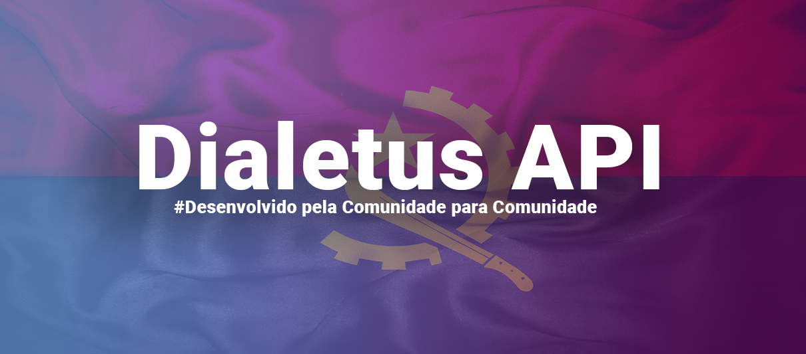

 # Dialetus API  - (Em desenvolvimento - Brevemente)

  
 <h1 align = center>
    
</h1>

  ## Objetivo da API 🎯
 
 A Dialetus API tem como objectivo tradução de Sites  angolanos, em uma determinada língua nacional Angolana.
 Visto que nós somos africanos e a áfrica está dividida  por tribos e reinos, com muitas váriações linguísticas em cada região. 

  ❤ A Dialetus APi é um projeto totalmente grátuito, temos como slogan: ' Desenvolvido pela comunidade para comunidade ' 

 ## Benificios 🧿

 Acreditamos que esta ferramenta vai ajudar na trudução de sites em diversas línguas nacionais, e o mais importante
 a partilha de informação em diversas línguas nacionais Angolana. Visto que somos composto por tribos, e nem todos tem o domínio da Lingua Portuguesa, então a ferramenta pode servir de grande ajuda para estas pessoas.

 Porém está ferramenta pode ser usada para desenvolvimento de outras aplicações, como de ensino das línguas nacionais etc.

## Quero ajudar a desenvolver esta API como faço?  📌

Caso se sinta disposto (a) a colaborar no desenvolvimento da API, sinta-se a vontade para contribuir com qualquer ideia para a resolução do problema que é tradução de sites em línguas nacionais Angolana.

obs: 'A contribuição em projeto open source, não é apenas codando!'

## Stack a ser usada -> ' Javascript '

## Pessoas na CDA - Community dev angola que já estão contribuindo ✨

- **[Lázaro Manuel](https://github.com/Lazaro-manuel)**    
-  **[Gentil Pinto](https://github.com/gentildpinto)** 
 
